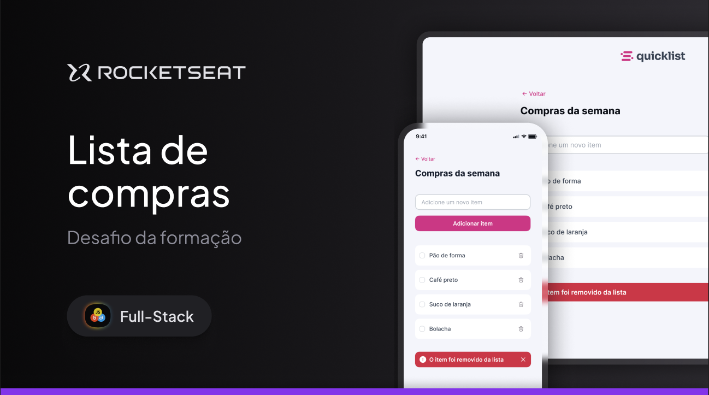
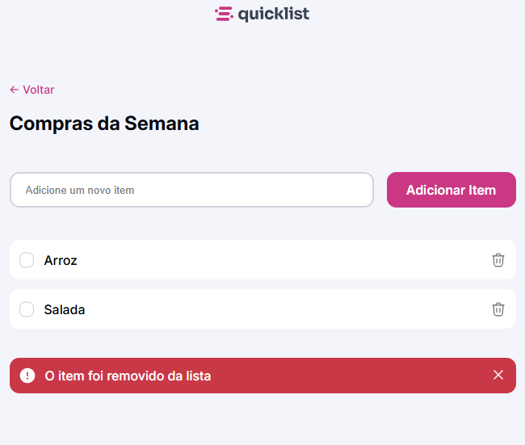

<h1 align="center"> Projeto Lista de Compras </h1>

  Desafio desenvolvido com o curso Fullstack da Rocketseat.  
  <strong>O principal objetivo deste projeto é aplicar os conceitos de Javascript.</strong>

  <a href="#-tecnologias">Tecnologias</a>&nbsp;&nbsp;&nbsp;|&nbsp;&nbsp;&nbsp;
  <a href="#-projeto">Projeto</a>&nbsp;&nbsp;&nbsp;

##
##

  
  
  

  

## 🚀 Tecnologias

Esse projeto foi desenvolvido com as seguintes tecnologias:

- HTML e CSS
- Javascript
- Git e Github
- Figma

## 💻 Projeto

Este projeto é uma lista de compras.
---

Feito com ♥ by May
